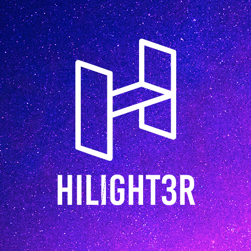

<h1 align="center">Welcome to the my profile!</h1>

Most of my projects are located here. You can use them all for yourself, observing the rules of the license.

***

  

***

## Stats

***

## About me

Hello! My name is Vladislav. I have been fond of programming since 2017. I like this.

***

## Contact or follow me

